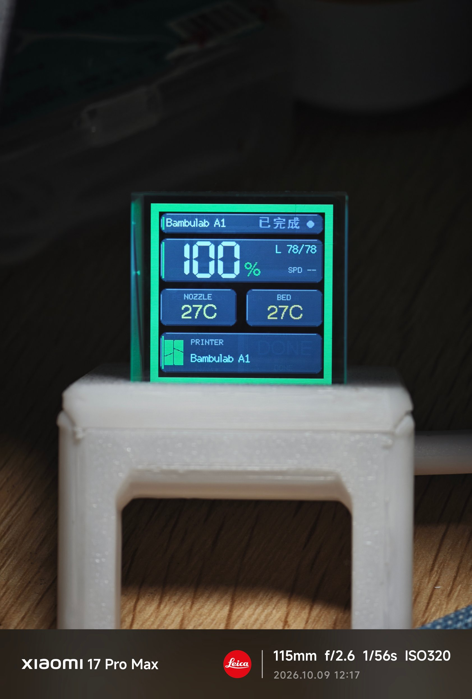
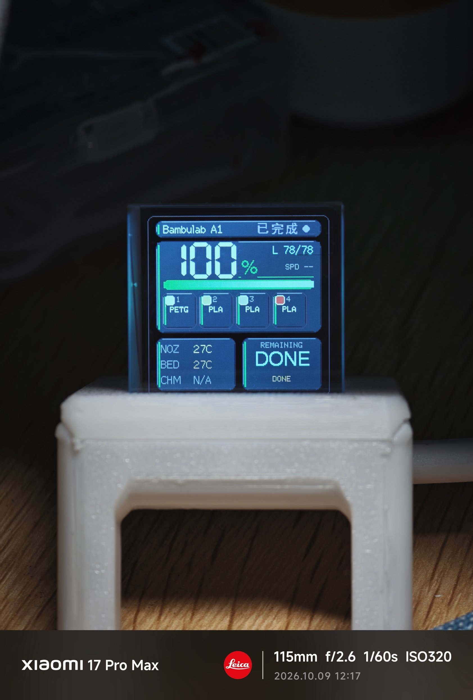
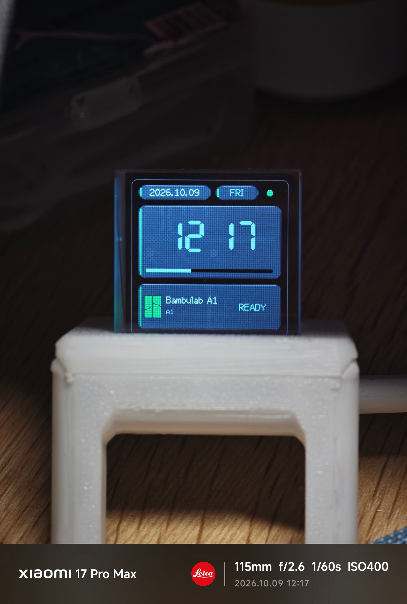
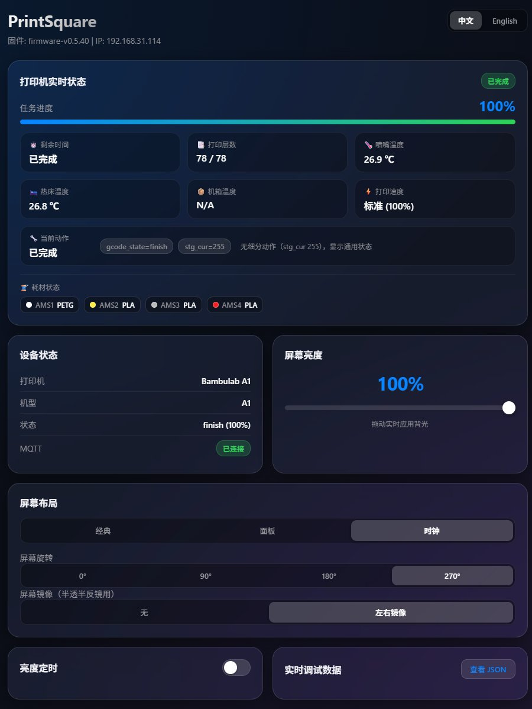

[ English Version ](README_en.md) | [ 简体中文 ](README.md)

# PrintSquare (Fork 版本)


📦 仓库地址：[https://github.com/huangyiqian/PrintSquare](https://github.com/huangyiqian/PrintSquare)

本项目为原版 [PrintSphere Lite](https://github.com/ccord34/printsphere-lite) 的增强改进版本（Fork）。基于 ESP8266EX 与 240x240 ST7789 屏幕，专为 Bambu Lab（拓竹）3D 打印机打造的桌面打印状态与 AMS 耗材监控小电视。

---

## 📌 功能介绍

### 🌈 AMS（拓竹多色系统）与外挂料盘（Ext Spool）显示支持
* **多色耗材与外挂料盘渲染**：实时解析 AMS 槽位状态，显示每个槽位的耗材颜色、材质类型与加载状态。
* **无 AMS 场景自适应排版**：自动识别打印机是否接入 AMS，无 AMS 时隐藏冗余空槽位，并以外挂料盘（Ext Spool）紧凑显示。
* **官方与第三方耗材区分**：官方 RFID 耗材显示剩余容量，第三方或无 RFID 耗材只显示色块与材质，避免误导性余量。
* **BGR565 颜色校正**：适配 ST7789 屏幕，准确显示耗材颜色。

### 📊 屏幕 UI 与显示布局
* **三套屏幕布局**：经典、信息面板（Dashboard）、时钟三套布局，均适配 240x240 ST7789 屏幕，可在 ESP 内置 8081 后台一键切换。
* **完整打印信息**：同时展示打印进度、喷嘴温度、热床温度、仓温、层数与预计剩余时间。
* **打印机细分状态**：解析 Bambu MQTT 的 `stg_cur` 动作阶段，把「自动调平」「热床预热」「振动补偿」「换料中」「退料中」「进料中」「回零中」「清洁喷嘴」「喷嘴加热」「挤出校准」「电机校准」「断料暂停」「喷嘴裹料」「喷嘴堵塞」等**具体动作**显示在三套布局的右上角，不再只有打印中 / 空闲 / 错误 / 离线四态。
* **状态中英双语**：同一状态可显示为英文缩写（如 `BEDLVL`、`FLOWCAL`）或**中文点阵字**（如「自动调平」「换料中」），跟随 8081 页面的中英文开关同步切换并断电保存；A1 / P1 用不到的机型专用阶段自动回退为通用状态，未列出的报错统一显示「错误」。
* **背光亮度与定时**：0-100% 手动亮度，另有日间 / 夜间分时段亮度规则（8081 后台可配置），断电保存。
* **半透半反镜支持（镜像）**：面向 HoloCubic 风格 45° 半透半反镜装配，提供「无镜像 / 左右镜像」两档——镜面反射出的镜像无法用任何旋转角度修正，只能靠镜像功能；镜像可与 0° / 90° / 180° / 270° 旋转自由组合，在 ESP 8081 后台与桌面配置工具都能切换，写入 LittleFS、重启后自动恢复。
* **屏幕旋转**：0° / 90° / 180° / 270° 步进旋转，断电保存；只有方向变化才清屏重绘，普通数据刷新仍是局部更新。
* **平滑视觉效果**：使用连续渐变进度条和玻璃拟态元素，数据刷新采用局部更新以减少整屏闪烁。

### 🌐 Web 配置工具
* **设备配置**：WiFi 扫描、打印机选择与同步、屏幕布局 / 亮度 / 旋转 / 镜像设置；写入优先走 USB 串口，局域网 HTTP 作为兜底。
* **实时监控**：可查看打印状态、进度、温度、层数、剩余时间、耗材槽位，以及**当前动作**（同时给出 MQTT 原始状态码 `gcode_state` / `stg_cur` 与说明，便于排查）。
* **多设备管理**：按 MAC / device_id 为每台 ESP 保存独立档案（WiFi、串口、地址、已选打印机），云账号与打印机列表共用。
* **双端口访问**：同一个后台同时监听 80 与 8081，浏览器不输端口也能打开；日常建议访问 `http://ESP的IP:8081/`。
* **中英文切换**：ESP 内置 8081 页面右上角可切换 中文 / English，选择会记在浏览器本地；**同时会同步到设备，决定屏幕自身显示中文还是英文缩写**。

---

## 🖼️ 界面与实机效果预览

| 经典布局 (Classic) | 信息面板布局 (Dashboard) | 时钟布局 (Clock) |
| :---: | :---: | :---: |
|  |  |  |

### Web 后端配置界面
<p align="center">
  
</p>

---

## 🛠️ 硬件需求与引脚连接

* **主控**：ESP8266EX / NodeMCU 兼容开发板
* **屏幕**：240x240 7针 ST7789 SPI 显示屏
* **外壳**：外壳模型推荐 [全息打印机进度监视器](https://makerworld.com.cn/zh/models/3052148-55yuan-cheng-ben-quan-xi-da-yin-ji-jin-du-jian-shi#profileId-3589179)
* **接线参考 (PlatformIO 默认)**：
  * `CS`: GPIO 15
  * `DC`: GPIO 0
  * `RST`: GPIO 2
  * `BL`: GPIO 5 (PWM 背光控制)

---

## 🚀 快速上手使用

1. 到 [GitHub Release](https://github.com/huangyiqian/PrintSquare/releases) 下载最新压缩包 `PrintSquare_v<版本>_<日期>_build.zip` 并解压。
2. 用 USB 线将 ESP8266 连接到 Windows 电脑，双击压缩包里的 `刷固件工具\一键刷入固件.bat`，按提示选择串口并完成刷机。
3. 打开 `后端配置工具\PrintSquare配置工具.exe`（单文件工具，双击即用），在自动打开的浏览器页面中登录 Bambu Lab 账号。
4. 选择或填写 2.4G WiFi 名称与密码，点击 **“保存并配置 ESP WiFi”**。
5. 刷新打印机列表，选中你的拓竹打印机并点击 **“显示这台并同步”**。
6. ESP8266 屏幕出现数据后即可拔下电脑 USB，改用任意 5V USB 供电使用。
7. 设备连上 WiFi 后，也可以通过浏览器直接访问 `http://[ESP的局域网IP]:8081/` 进行轻量无线管理。

---

## 💻 编译与构建

项目基于 [PlatformIO](https://platformio.org/) 构建，如需修改源码并自行编译：

```bash
# 编译 ESP8266 固件
platformio run -e sd2
```

编译产物路径：`.pio/build/sd2/firmware.bin`

---

## 📄 License 与致谢

* 本项目基于 [ccord34/printsphere-lite](https://github.com/ccord34/printsphere-lite) 原项目进行修改和增强。
* 本项目仅供个人学习、交流及非商业用途使用。商业使用、批量生产或集成付费服务需获得原作者授权。详细声明见 [LICENSE](LICENSE)。
