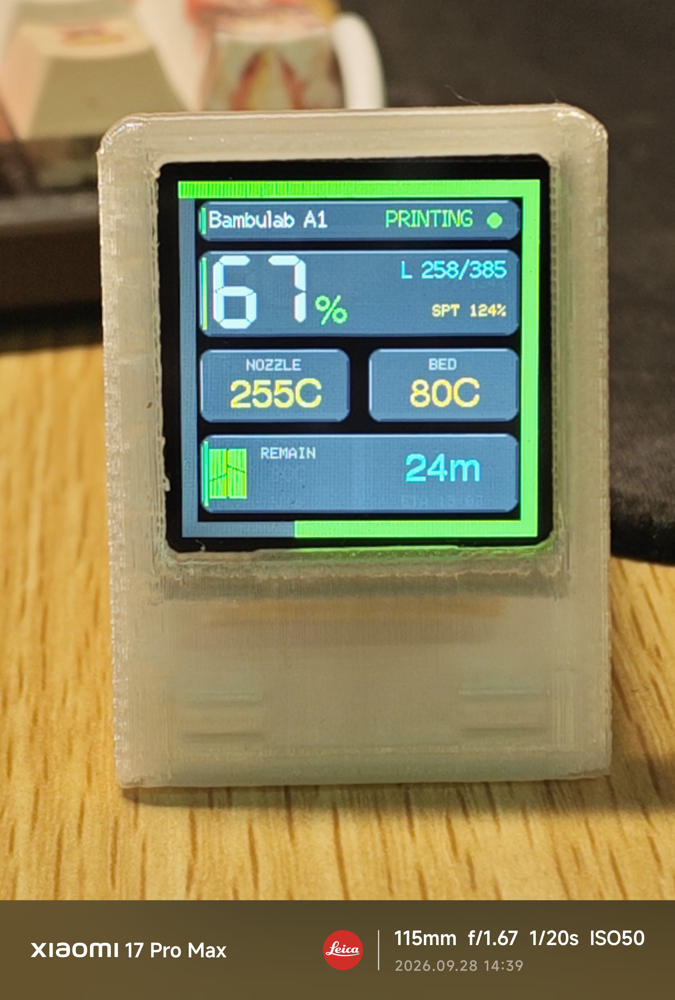
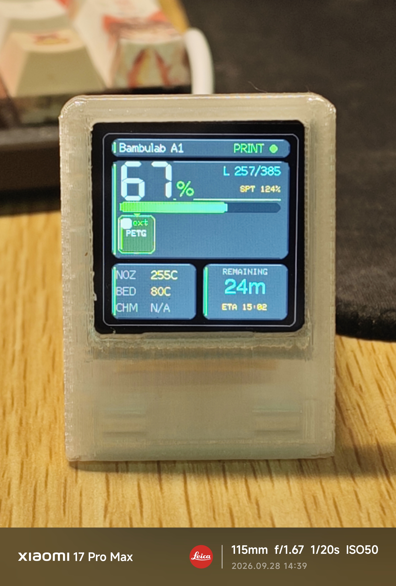
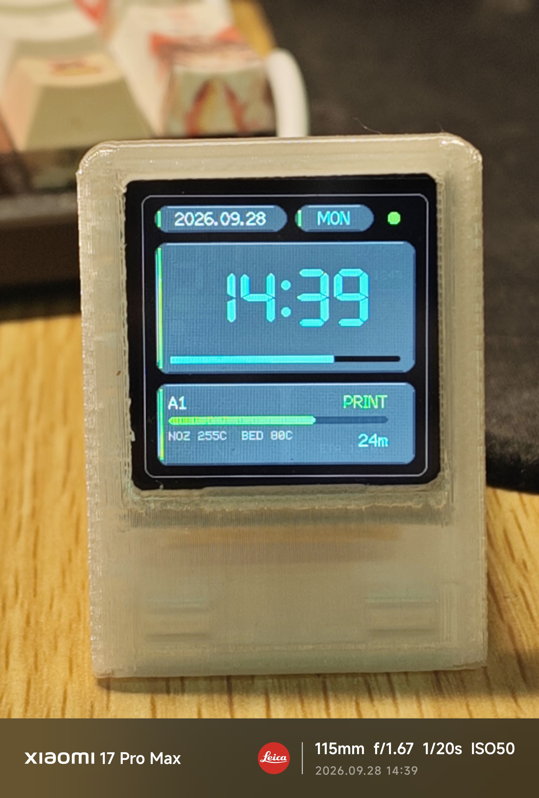
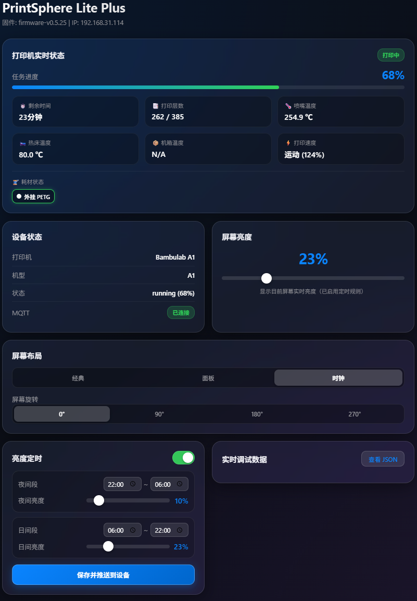

[ 简体中文 ](README.md) | [ English ](README_en.md)

# PrintSphere Lite Plus (Enhanced Fork)


This project is an enhanced and improved fork of the original [PrintSphere Lite](https://github.com/ccord34/printsphere-lite). Powered by ESP8266EX and a 240x240 ST7789 display, it serves as a mini desktop monitor for real-time printing status and AMS filament tracking for Bambu Lab 3D printers.

---

## 📌 Features

### 🌈 AMS & External Spool Support
* **Multi-color filament rendering**: Displays real-time AMS slot colors, material types, and loading status.
* **Adaptive no-AMS layout**: Automatically detects AMS presence, hides unused slots, and presents the external spool compactly.
* **Official and third-party filament handling**: Shows remaining capacity for official RFID filaments while third-party or non-RFID filaments display only color and material to avoid misleading estimates.
* **ST7789 color calibration**: Uses corrected BGR565 color mapping for accurate filament colors.

### 📊 Screen UI & Layouts
* **Three display modes**: Provides Classic, Dashboard, and Clock layouts for the 240x240 ST7789 display.
* **Complete print overview**: Shows print progress, nozzle temperature, bed temperature, chamber temperature, and estimated remaining time.
* **Display controls**: Supports 0-100% backlight brightness, automatic dimming when idle, and 90-degree rotation steps persisted across power loss.
* **Smooth visual effects**: Uses continuous gradient progress indicators and glass-inspired elements, with partial updates to reduce full-screen flicker.

### 🌐 Web Configuration Tool
* **Device setup**: Supports Wi-Fi scanning, printer selection and synchronization, display layout switching, brightness, and rotation settings.
* **Live monitoring**: Provides print status, progress, temperatures, layer information, remaining time, and filament slot data.
* **Multi-device management**: Isolates configuration per hardware identifier, prioritizes USB serial writes, and uses HTTP over the local network as a fallback.
* **Dual-port access**: Provides Web management pages on both port 80 and port 8081.

---

## 🖼️ Interface & Hardware Previews

| Classic Layout | Dashboard Layout | Clock Layout |
| :---: | :---: | :---: |
|  |  |  |

### Web Backend Configuration Interface
<p align="center">
  
</p>

---

## 🛠️ Hardware Requirements & Pinout

* **MCU**: ESP8266EX / NodeMCU compatible board
* **Display**: 240x240 7-pin ST7789 SPI LCD Screen
* **Enclosure**: 外壳模型可选择https://makerworld.com.cn/zh/models/2587841-cheng-ben-25-printsphere-litetuo-zhu-da-yin-zhuang#profileId-2978954
* **Pin Connections (PlatformIO Default)**:
  * `CS`: GPIO 15
  * `DC`: GPIO 0
  * `RST`: GPIO 2
  * `BL`: GPIO 5 (PWM Backlight Control)

---

## 🚀 Quick Start

1. Connect ESP8266 to your Windows PC using a USB data cable.
2. Open `后端配置工具\PrintSphere配置工具.exe` (single-file tool, just double-click), which opens the WebUI in your default browser, and log in to your Bambu Lab account.
3. Select or enter your 2.4G Wi-Fi SSID and password, then click **“Save & Configure ESP WiFi”**.
4. Refresh printer list, select your target Bambu printer, and click **“Show This Printer & Sync”**.
5. Once print data appears on the ESP8266 screen, you can unplug the device from your computer and power it via any 5V USB source.
6. Once connected to Wi-Fi, you can also manage the device directly in your browser via `http://[ESP_IP_ADDRESS]:8081/`.

---

## 💻 Build & Compile

This project is built using [PlatformIO](https://platformio.org/):

```bash
# Build ESP8266 firmware
platformio run -e sd2
```

Compiled binary output: `.pio/build/sd2/firmware.bin`

---

## 📄 License & Acknowledgements

* Based on the original project [ccord34/printsphere-lite](https://github.com/ccord34/printsphere-lite).
* Intended for personal learning, hobbyist, and non-commercial use only. Commercial use, mass production, or integration into paid services requires authorization from the original author. See [LICENSE](LICENSE) for details.
